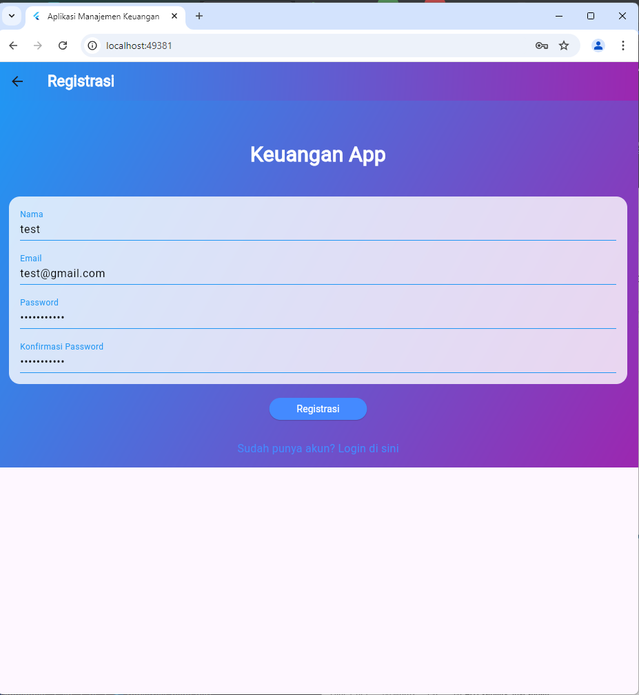
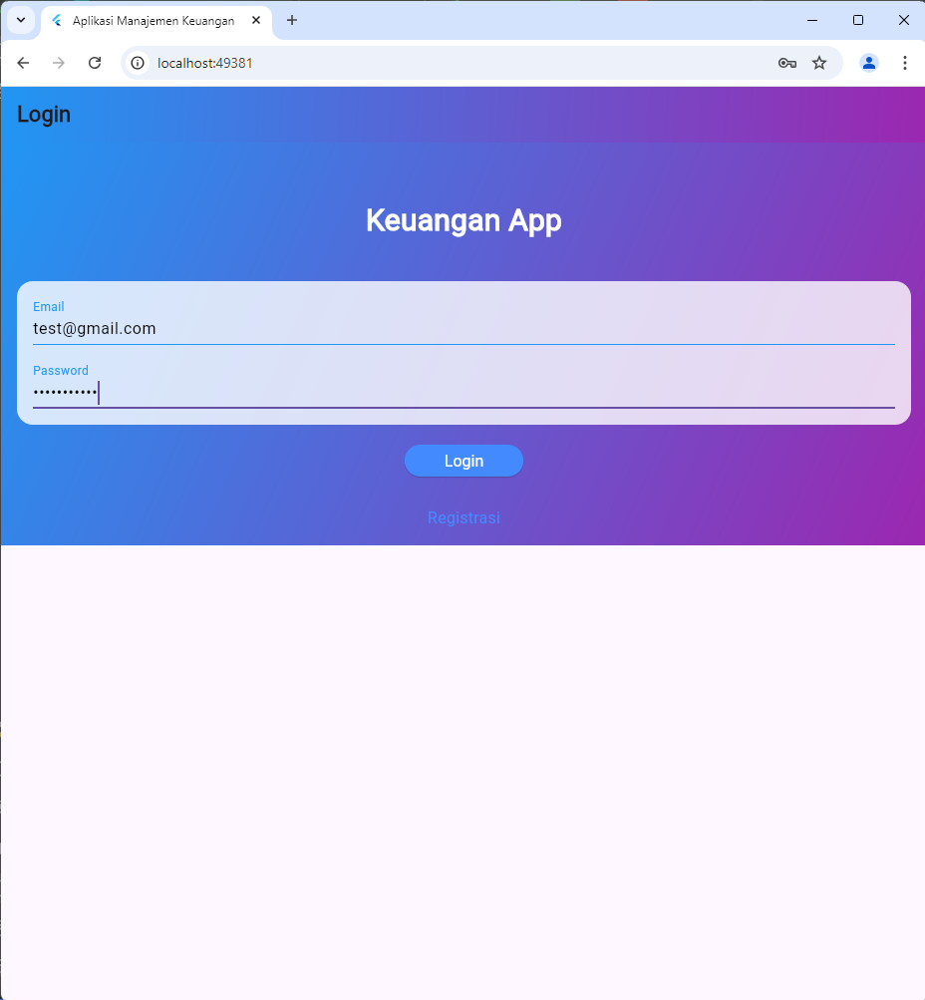
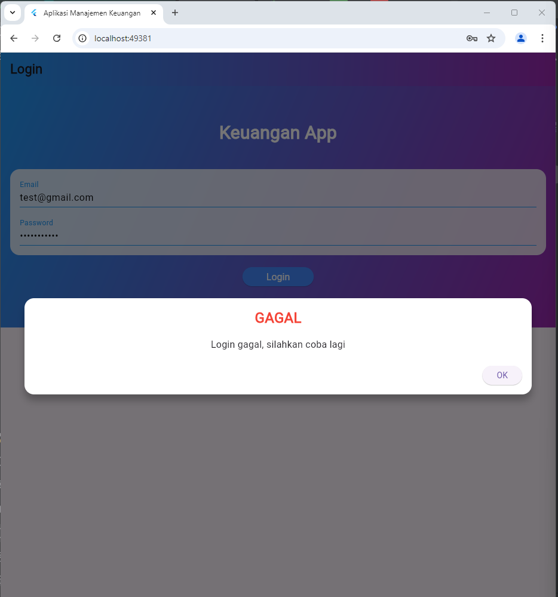

# Aplikasi Manajemen Keuangan
Paket 2
Tabel Saldo
Kustomisasi Tampilan UI : Tema Gradient Biru-Ungu, Font Courier New

##RegistrasiPage
RegistrasiPage merupakan halaman registrasi pada aplikasi Keuangan App. Halaman ini menyediakan antarmuka bagi pengguna untuk mendaftar akun baru. Berikut adalah rincian mengenai komponen yang terdapat pada halaman ini.
###Fungsi-fungsi Utama
_submit(): Fungsi ini akan dijalankan ketika tombol "Registrasi" ditekan. Fungsi ini melakukan:
###Validasi formulir.
Jika validasi berhasil, mengirim data ke server menggunakan RegistrasiBloc.registrasi().
###Menampilkan dialog sukses atau peringatan berdasarkan hasil registrasi.
_logo(): Fungsi ini menampilkan logo atau heading "Keuangan App" di bagian atas halaman.

_registrationForm(): Fungsi ini menghasilkan formulir yang terdiri dari empat input field: Nama, Email, Password, dan Konfirmasi Password.

_buttonRegistrasi(): Fungsi ini mengelola tampilan tombol registrasi dan aksi yang dilakukan saat tombol ditekan.

_menuLogin(): Fungsi ini menampilkan tautan bagi pengguna yang sudah memiliki akun untuk kembali ke halaman login.

###Dependency yang Digunakan
RegistrasiBloc: Berfungsi untuk mengelola proses registrasi ke backend.
SuccessDialog & WarningDialog: Widget yang digunakan untuk menampilkan dialog sukses atau peringatan saat proses registrasi selesai.
Validasi dan Pengiriman Data
Setiap input dalam formulir memiliki validasi yang harus dipenuhi pengguna sebelum data dikirim. Validasi ini mencakup:

## Screenshot 

