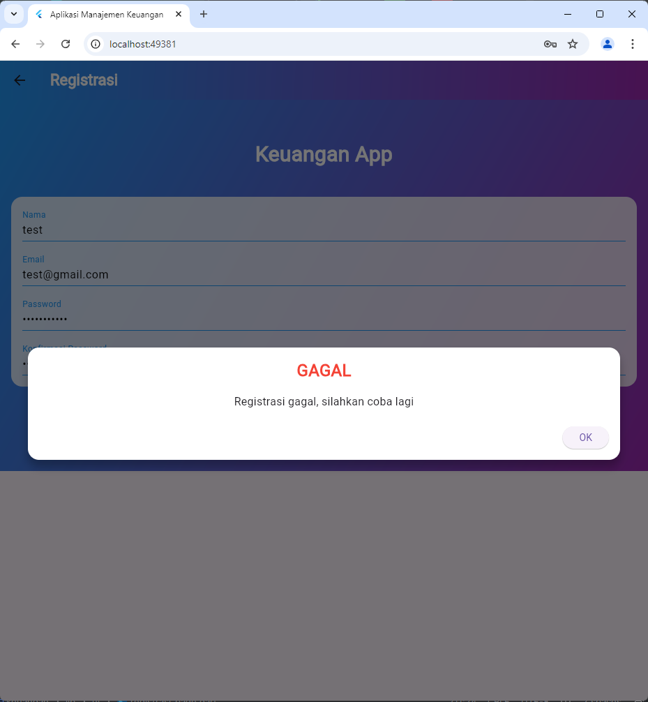

# Aplikasi Manajemen Keuangan
Paket 2

Tabel Saldo

Kustomisasi Tampilan UI : Tema Gradient Biru-Ungu, Font Courier New

RegistrasiPage
RegistrasiPage merupakan halaman registrasi pada aplikasi Keuangan App. Halaman ini menyediakan antarmuka bagi pengguna untuk mendaftar akun baru. Berikut adalah rincian mengenai komponen yang terdapat pada halaman ini.

Struktur Halaman
AppBar:

Terdapat judul "Registrasi" dengan gaya font Courier New dan warna teks putih.
Latar belakang AppBar menggunakan gradient dengan perpaduan warna biru dan ungu.
Body:

Latar belakang halaman juga menggunakan gradient dengan warna biru dan ungu yang serupa dengan AppBar.
Halaman ini dirancang dengan menggunakan widget SingleChildScrollView agar bisa digulir (scroll) jika tampilan melebihi ukuran layar.
Logo:

Di bagian atas halaman, terdapat teks "Keuangan App" yang berfungsi sebagai logo atau heading. Teks ini menggunakan gaya Courier New, dengan ukuran 30 dan warna putih.
Formulir Registrasi:

Form ini terdiri dari beberapa input field seperti Nama, Email, Password, dan Konfirmasi Password.
Setiap input memiliki validasi tersendiri:
Nama: Minimal 3 karakter.
Email: Menggunakan ekspresi reguler untuk memverifikasi format email.
Password: Minimal 6 karakter.
Konfirmasi Password: Harus sama dengan isian pada password.
Tombol Registrasi:

Tombol ini digunakan untuk memvalidasi formulir dan mengirim data registrasi.
Jika semua input valid dan tidak ada kesalahan, data akan dikirim menggunakan RegistrasiBloc.registrasi().
Jika berhasil, dialog sukses akan muncul. Jika gagal, dialog peringatan akan tampil.
Menu Login:

Terdapat tautan "Sudah punya akun? Login di sini" yang memungkinkan pengguna untuk kembali ke halaman login jika sudah memiliki akun.
Fungsi-fungsi Utama
_submit(): Fungsi ini akan dijalankan ketika tombol "Registrasi" ditekan. Fungsi ini melakukan:

Validasi formulir.
Jika validasi berhasil, mengirim data ke server menggunakan RegistrasiBloc.registrasi().
Menampilkan dialog sukses atau peringatan berdasarkan hasil registrasi.
_logo(): Fungsi ini menampilkan logo atau heading "Keuangan App" di bagian atas halaman.

_registrationForm(): Fungsi ini menghasilkan formulir yang terdiri dari empat input field: Nama, Email, Password, dan Konfirmasi Password.

_buttonRegistrasi(): Fungsi ini mengelola tampilan tombol registrasi dan aksi yang dilakukan saat tombol ditekan.

_menuLogin(): Fungsi ini menampilkan tautan bagi pengguna yang sudah memiliki akun untuk kembali ke halaman login.

Dependency yang Digunakan
RegistrasiBloc: Berfungsi untuk mengelola proses registrasi ke backend.
SuccessDialog & WarningDialog: Widget yang digunakan untuk menampilkan dialog sukses atau peringatan saat proses registrasi selesai.
Validasi dan Pengiriman Data
Setiap input dalam formulir memiliki validasi yang harus dipenuhi pengguna sebelum data dikirim. Validasi ini mencakup:

Nama: Harus minimal 3 karakter.
Email: Harus mengikuti format email yang valid.
Password: Minimal 6 karakter.
Konfirmasi Password: Harus sama dengan input Password.
Jika semua validasi berhasil, data akan dikirim melalui RegistrasiBloc.registrasi() yang mengelola koneksi ke server untuk menyimpan akun baru.

## Screenshot 

